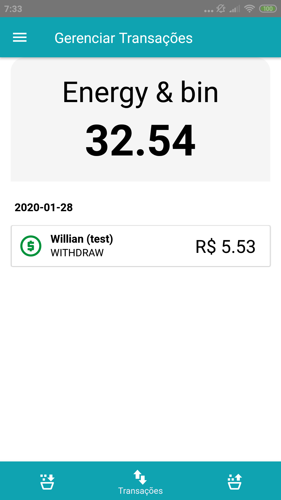
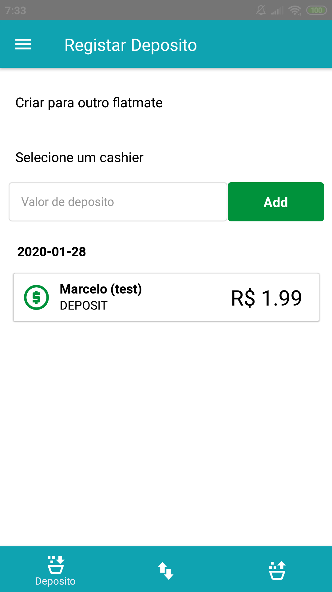

# About
A management system / common payment savings in shared houses where all the members of the house must contribute money for specific accounts such as energy, water, electricity, food and others.

## Backand project

The project server contains all the services that mobile and web applications can access, such as flatmates, savings cashier and transactions. The system has the option of accessing other accounts in case the user was invited.

### Tools and Technologies to be used
*	Use Maven for dependency management.
* Spring Oauth2, Spring Security, JPA. 
* h2database for the database.
* Spring Boot for the server.
* String Test Tools for testing.

### Dependencies and Software with Eclipse

    1. Download and Install JDK
    2. Download and Install Eclipse
    3. Download and Install ?? Plugin Maven for lombok ??
    4. Install Dependencies from pom.xml
    5. Right Click on /src/main/java/br/com/housecash/backend/App.java > Run

## Mobile project 

In the image below, the mobile application made with react-native is consuming the server, being able to execute search functions and changes in the system's cashiers.

 
 

## Features

* **Dashboard**:The user can access other accounts that were invited. Users can only execute transaction command. 
* **Flatmates**: Each user can manage your roommates (permission denied when invited).
* **Cashier**: Each user can manage your cashiers (permission denied when invited).

## Issues

If face an issue, please notify it [here](https://github.com/marcelobojikian/cash-house/issues) as a new issue.

## License

All code in this repository is under the MIT license as specified by the LICENSE file.

